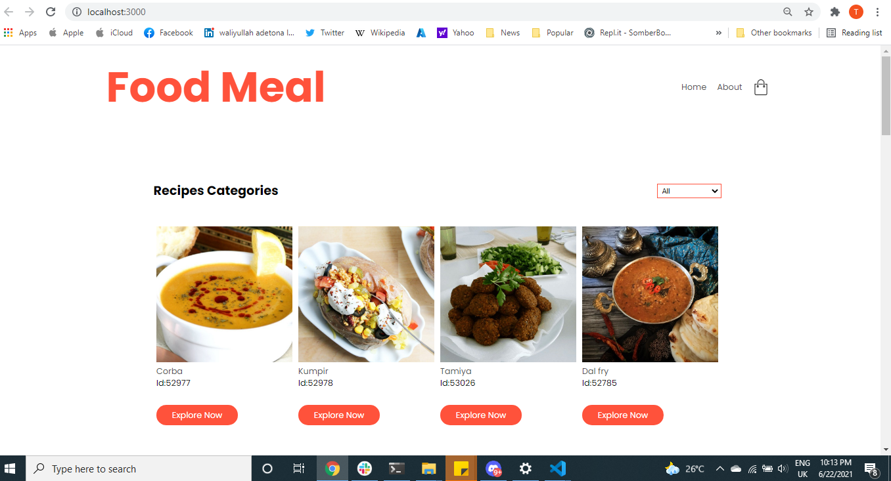
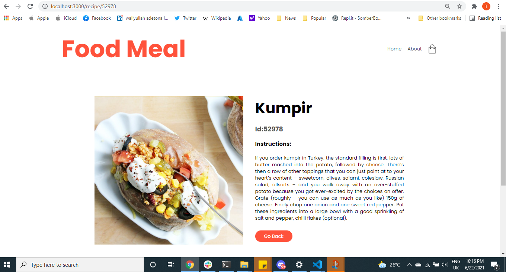
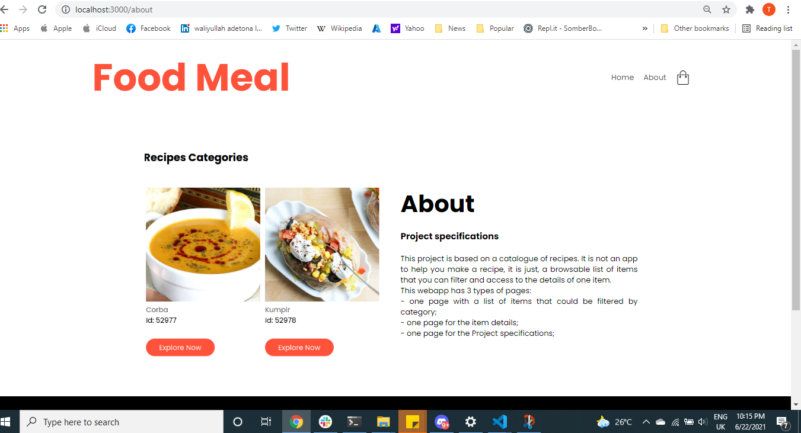

# Catalogue of Recipes
This project is based on a catalogue of recipes. It is not an app to help you make a recipe, it is just, a browsable list of items that you can filter and access to the details of one item.

This webapp has 3 types of pages:
* one page with a list of items that could be filtered by category;
* one page for the item details;
* one page for the Project specifications;

## Built With
* HTML and JSX
* React
* CSS
* ES6

## Getting Started:

To get a local copy up and running follow these simple example steps:

1. Under the repository name, click the Clone or download green button.

2. Copy the URL given by clicking the clipboard button.

3. Open a terminal window in your local machine and change the current directory to the one you
   want the clone directory to be made.

4. Type  git clone and then paste the URL you previously copied to the clipboard.

5. Open a new terminal window in your local machine and change the current directory to your
   cloned directory.

6. Run `npm install` / `npm i` from the Terminal.

7. after that `npm run build` from the terminal.

8. Finally `npm start`.

## Testing :

$ npm test

## See a live demo [Here](https://nervous-aryabhata-c30a75.netlify.app/)

## Show your support
Give a ⭐️ if you like this project!

# Screenshot

* 
* 
* 

## Authors

👤 Taiwo Adetona

- Github: [@taiwo2](https://github.com/taiwo2)

- LinkedIn: [Taiwo Adetona](https://www.linkedin.com/in/taiwo-adetona/)

- Twitter: [@TaiwoAdetona4](https://twitter.com/TaiwoAdetona4/)

## 🤝 Contributing

Contributions, issues and feature requests are welcome!

Feel free to check the [issues page](../../issues/).

## Show your support

Give a ⭐️ if you like this project!

## Acknowledgments

- Microverse, for the lessons and tips.

## 📝 License

MIT License
